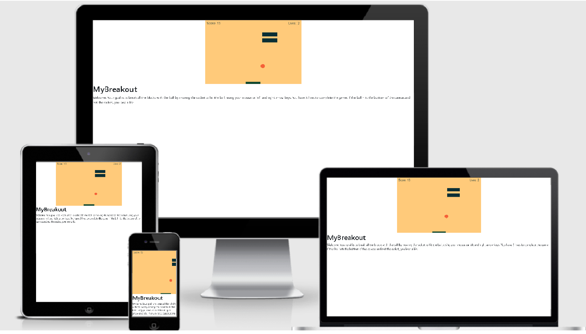

<html lang="en">
<h1>MyBreakout Game</h1>

   
   Breakout was a video game released by Atari in 1976. For further info about it's history, use this link; https://en.wikipedia.org/wiki/Breakout_(video_game)
   I have used the code for this project directly from a tutorial from the Mozilla Developer's Network; https://developer.mozilla.org/en-US/docs/Games/Tutorials/2D_Breakout_game_pure_JavaScript
   It is based entirely on JavaScript and rendered on the HTML5 canvas element.

   I chose this game for my milestone project 2 for the Full Stack Developer course from the Code Institute:https://codeinstitute.net/
   This is a simple game that uses a lot of javascript functionality in it's creation and execution.  I tried to build it as responsive as possible, however I regret that 
   I was unable to get touch controls for touch screen devices working for this implementation.

<h2>UX</h2>
    

    This site is designed for someone who wants to play a simple, somewhat challenging game.
    

<h4>User Stories</h4>
    <ul>
       <li>
           
  As a user, I want this game to be easily playable.

       </li>
       <li>
           
  As a player it is pretty much self explanatory and short in play time.

       </li>
     </ul>  
<h2>Features</h2>
<h3>Existing Features</h3>
    <ul>
        <li>
           
 HTML5 canvas with blocks, racket and ball. 

        </li>   
        <li>
           
 Controllable racket via keyboard arrow keys, or mouse.

        </li>
        <li>
           
 Score and Lives counters

        </li>
        <li>
            
 Collision detection

        </li>   
    </ul>
<h3>Features Left to Implement</h3>
    <ul>
        <li>
            
 Touch Screen controls of the racket and the game in general

        </li>
    </ul>
<h2>Technologies Used</h2> 
    <ol>
        <li>
            
<strong>HTML, or Hyper Text Markup Language:</strong>Used to construct all the pages of this web site. For further info on this language;
             https://developer.mozilla.org/en-US/docs/Web/HTML

        </li>
        <li>
            
<strong>CSS, or Cascading Style Sheets:</strong>: Is used to style various elements on a web page via coloring, fonts, spacing, etc. For further info, see this link; https://www.w3.org/Style/CSS/Overview.en.html
            

        </li>
        <li>
            
<strong>JavaScript</strong>: A lightweight, interpreted, or just-in-time compiled programming language with first-class functions. 
            https://developer.mozilla.org/en-US/docs/Web/JavaScript
            

        </li>
        <li>
            
<strong>Bootstrap:</strong> A CSS framework that assists the programmer in creating responsive, mobile first front-end web sites. https://getbootstrap.com/
            

        </li>
        <li>
            
<strong>Visual Studio Code:</strong>Is a programming code editor created by Microsoft that I used extensively. It allows programmers to create, save and edit their code on their own pc's. https://code.visualstudio.com/
            

        </li>
        <li>
            
<strong>SourceTree:</strong>A software application that runs on your computer that simplifies saving your programming code from your PC up to an oline respository like Github. You do not have to use a command line interface when using this application. For further info; https://www.sourcetreeapp.com/
            

        </li>
        <li>
           
<strong>Git:</strong> A version control system for tracking changes in source code during software development. https://git-scm.com/
           

        </li>
        <li>
            
<strong>GitHub:</strong>A company that provides hosting for software development version control using Git. It is a subsidiary of Microsoft. https://github.com
            

        </li>
        <li>
            
<strong>Chrome DevTools:</strong>A set of web developer tools built directly into the Google Chrome browser. I used these tools constantly thoughout the development cycle. https://developers.google.com/web/tools/chrome-devtools
            

        </li>
        <li>
            
<strong>W3C Markup Validation Service:</strong>Used to run all html and css code thru a validation process looking for errors; https://validator.w3.org/
            

        </li>
        <li>
            
<strong>JSHint:</strong>JSHint is a static code analysis tool used in software development for checking if JavaScript source code complies with coding rules.
            https://jshint.com/
            

        </li>
    </ol>
<h2>Testing</h2>
    <ol>
        <li>
          
http://ami.responsivedesign.is/  has been used to see how the game scales on different size screens on Apple devices.  It looks pretty good on all screen sizes, however I was unable to get touch working for touch screen devices, to control the racket. I also checked it on my iPhone 11.
  
        </li>
        <li>
            
<strong>Desktop</strong>

                <ul>
                    <li> The game works correctly on Google Chrome, Internet Edge & Mozilla Firefox browsers</li>
                </ul>
        </li>
    </ol>
<h2>Deployment</h2>
    <ol>
        <li>
            
Created a Github account at https://github.com My account url; https://github.com/BobHerold

        </li>
        <li>
            
I uploaded all files to my Github repository located at this url; https://github.com/BobHerold/MyBreakout which is for this individual project.

        </li>
        <li>
            
To publish the project to see it on the web, I then went into the Settings on my respository, scrolled down to the heading, GitHub Pages. Under the Source setting, I used the drop-down menu to select master branch as a publishing source and saved it. Refreshed the github page, and you are then given a url where your page is published; Your site is published at https://bobherold.github.io/MyBreakout/

        </li>
        <li>
            
To run this code on your local machine, you would go to my respository at https://github.com/BobHerold/MyBreakout and on the home page on the right hand side just above all the files, you will see a green button that says, "Clone or download", this button will give you options to clone with HTTPS, open in desktop or download as a zip file. To continue with cloning, you would;

        </li>
    </ol>
        <ul>
            <li>Open Git Bash</li>
            <li>Change the current working directory to the location where you want the cloned directory to be made.</li>
            <li>Type git clone, and then paste this URL; https://github.com/BobHerold/MyBreakout.git Press Enter. Your local clone will be created.</li>
        </ul> 
            
For more information about the above process; https://help.github.com/en/github/creating-cloning-and-archiving-repositories/cloning-a-repository
 
<h2>Credits</h2>
    <h3>Content</h3>
        <ol>
            <li>
                
 All code came directly from this tutorial; 2D breakout game using pure JavaScript, located at this Url; https://developer.mozilla.org/en-US/docs/Games/Tutorials/2D_Breakout_game_pure_JavaScript  
                   I have modified it somewhat, changing some variable names, colors, etc.  I have tried to comment on each section throughout the game to explain all processes.

            </li>
        </ol>
    <h3>Media</h3>
        <ol>
            <li>
                
screenshot .jpg from http://ami.responsivedesign.is/

            </li>
            <li>
                
mockups.jpg from my iPhone 11/

            </li>
            <li>
                
Color paletted used came from; https://colors.muz.li/palette/12492f/0a2f35/f56038/f7a325/ffca7a

            </li>
         </ol>
     <h3>Acknowledgements</h3>
         <ul>
             <li>
                 
Code Institute's Claire, for her phone calls and support in getting me over a terrible block I was having in completing this project.  I asked for an extension 3 different times and struglled greatly with this project.  All other Tutors & support people who have assisted me from the Code Institute, along with CI's Slack channel.

             </li>
              <li>
                 
My Mentor Sandeep Aggarwal for inspiration, programming help and great advice. https://www.linkedin.com/in/asandeepme/

             </li>
             <li>
                 
My son Dakota Herold for his support, advice and recommnendations. https://www.linkedin.com/in/dakotaherold/

             </li>
         </UL>
               
 </html>    

